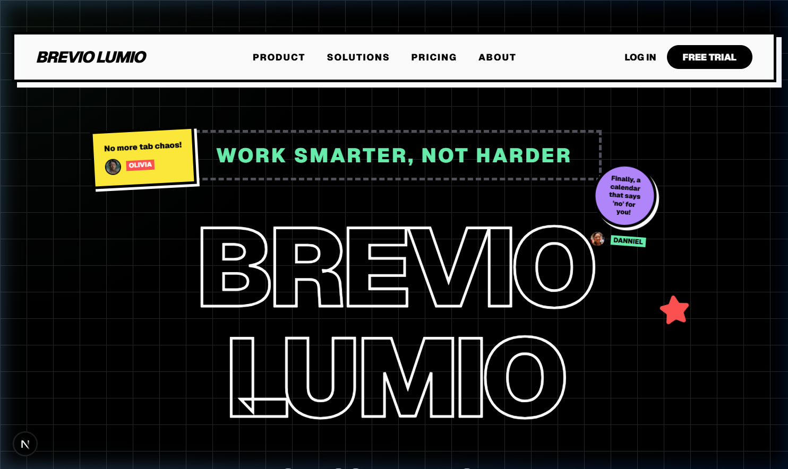
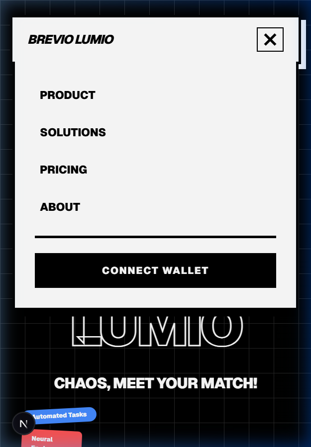
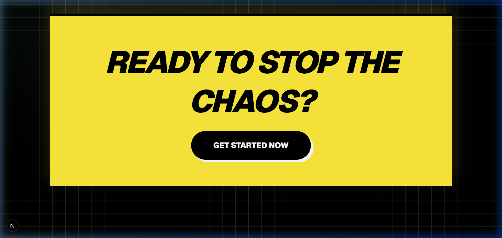

# Brevio Lumio: Neural Engine Evolution

I have completed the advanced evolution of the Brevio Lumio neural engine, focusing on "Visual Excellence" and "Kinetic Intelligence."

## 🚀 Key Achievements

### 1. Immersive Kinetic UI
- **Neural Mouse-Follow**: A dynamic radial gradient background that reacts to your every movement on the Landing Page and Dashboard.
- **Neural Ticker**: A continuously scrolling marquee displaying real-time neural statistics and system status.
- **3D Perspective Tilt**: All major cards (Notes, Resume Analysis) now feature a high-fidelity 3D tilt effect on hover.

### 2. Advanced AI Intelligence
- **Daily Neural Brief**: A new AI-driven synthesis at the top of your Smart Notes, summarizing your last 24 hours of neural activity.
- **Resume Match Score & Vectors**: Premium "Profile Strength" gauge using SVG animation and "Optimization Vectors" providing actionable AI advice to refine your career DNA.
- **Social Media Pulse**: YT Pulse now converts video summaries into social-media-ready threads.

### 3. Mobile Excellence
- **Neural Navigator**: A custom-built mobile hamburger menu and slide-out dashboard sidebar.
- **Adaptive Typography**: Headers and layouts now use `clamp()` and viewport units for flawless scaling on any screen size.

## 📸 Visual Verification

### 🎥 Feature Demo

## 🏁 Final Status: [BREVIO LUMIO COMPLETE]
Brevio Lumio is now a high-performance, visually stunning AI tool suite ready for production-level interaction.
